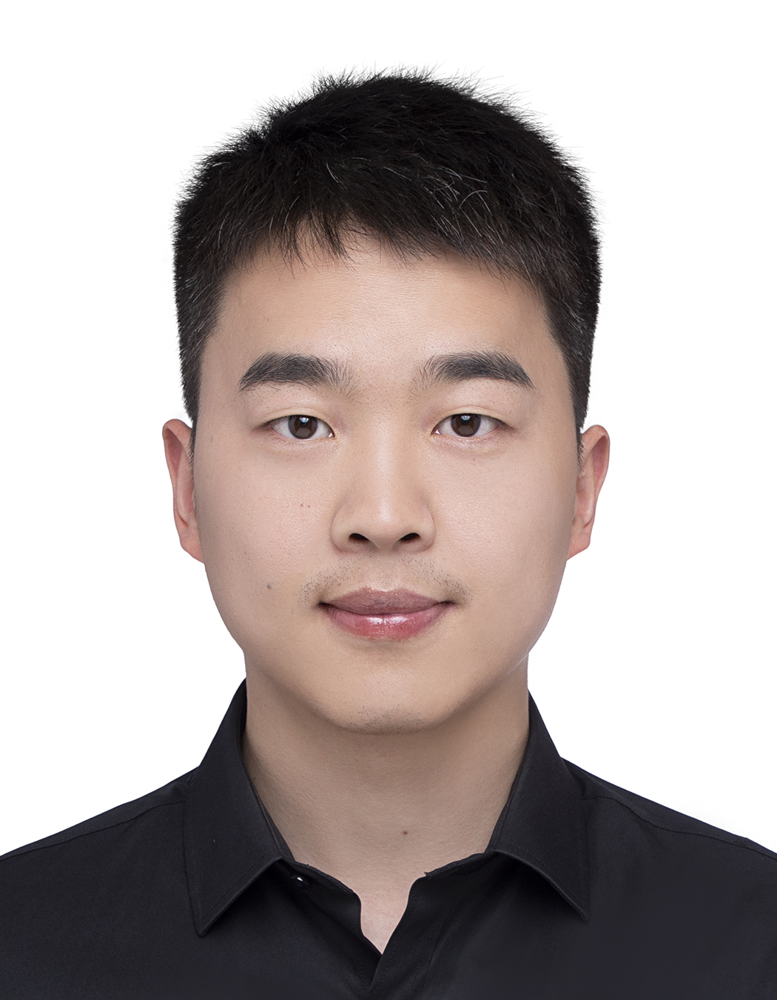

# Pengfei Liu (刘鹏飞)

**Phone:**\
+49 17644544310

**Email:**\
liupengfei50\@live.com\
pengfei.liu\@tuebingen.mpg.de

**Profiles:**\
[Google Scholar](https://scholar.google.com/citations?hl=zh-CN&user=-DD0lMQAAAAJ)\
[ORCID](https://orcid.org/0000-0002-6837-1006)

------------------------------------------------------------------------

## Education

**Ph.D. in Biology**\
Max Planck Institute for Biology Tübingen, Tübingen, Germany\
January 2021 - Present

**M. Sc. in Marine Biology**\
Shanghai Ocean University, Shanghai, China\
September 2017 - June 2020

------------------------------------------------------------------------

## Research Experience

### Max Planck Institute for Biology Tübingen

**PhD Student, Susana Coelho's Lab & Chang Liu's Lab**\
Tübingen, Germany \| January 2021 - Present

**Thesis:** Evolution of 3D chromatin architecture of brown algal genomes

-   Led studies on chromatin architecture in brown algae using high-throughput genomics and bioinformatics
-   Applied epigenomics uses techniques: Hi-C, ChIP-seq and RNA-seq to investigate chromatin roles during viral infection in reproductive cells of model brown algae species *Ectocarpus*

### Shanghai Ocean University

**Master Student, Zhigang Zhou's Lab**\
Shanghai, China \| September 2017 - June 2020

**Thesis:** BAC library construction from female gametophytes of commercially important brown algal species *Saccharina japonica* and cloning/sequencing of genes adjacent a female sex-specific marker FRML-1488

-   Built 3D BAC library for female gametophytes of *S. japonica*
-   Screened, sequenced, and assembled sex-related BAC clones

------------------------------------------------------------------------

## Publications

1.  **Pengfei Liu**, Rory J. Craig, et al. 2025. "Evolution of 3D chromatin architecture of brown algal genomes". (in preparation)

2.  Josué Barrera-Redondo†, Agnieszka P Lipinska†, **Pengfei Liu**, et al. 2025. "Origin and evolutionary trajectories of brown algal sex chromosomes". **Nature Ecology and Evolution** [doi.org/10.1038/s41559-025-02838-w](https://doi.org/10.1038/s41559-025-02838-w)

3.  **Pengfei Liu**, Jeromine Vigneau, Rory J. Craig, et al. 2024. "3D Chromatin Maps of a Brown Alga Reveal U/V Sex Chromosome Spatial Organization". **Nature Communications**, 15, 9590. [doi:10.1038/s41467-024-53453-5](https://doi.org/10.1038/s41467-024-53453-5)

4.  **Pengfei Liu**, Yanhui Bi, Qian Zheng, et al. 2023. "Molecular and FISH Analysis of 45S rDNA on BAC Molecule of *Saccharina japonica*". **Aquaculture and Fisheries** 8(2). [doi:10.1016/j.aaf.2021.07.002](https://doi.org/10.1016/j.aaf.2021.07.002)

5.  Yu Du, **Pengfei Liu**, Zhi Li, et al. 2022. "Discerning the Putative U and V Chromosomes of *Saccharina japonica* by Cytogenetic Mapping of Sex-Linked Molecular Markers". **Frontiers in Marine Science** 9. [doi:10.3389/fmars.2022.821603](https://doi.org/10.3389/fmars.2022.821603)

6.  **Pengfei Liu**, Jungang Gu, Yanhui Bi, et al. 2021. "Construction of a BAC Library of Female Gametophytes of *Saccharina japonica* and Map Cloning and Sequencing of Genes Neighboring a Female-Specific Marker FRML-1488". **Journal of Fisheries of China** 45(5). [doi:10.11964/jfc.20200112143](https://doi.org/10.11964/jfc.20200112143)

7.  Yu Liu, **Pengfei Liu**, Yanhui Bi, et al. 2021. "Chromosomal Mapping of 5S and 18S-5.8S-25S rRNA Genes in *Saccharina japonica* by Dual-Color FISH". **Journal of Oceanology and Limnology** 39(2). [doi:10.1007/s00343-020-9276-5](https://doi.org/10.1007/s00343-020-9276-5)

8.  Wushan Dong†, **Pengfei Liu†**, Yu Liu, et al. 2020. "Immunocytochemical Localization of the Kinetochore Protein Nuf2p on Gametophyte Chromosomes of a Saccharina Cultivar". **Frontiers in Marine Science** 7. [doi:10.3389/fmars.2020.539260](https://doi.org/10.3389/fmars.2020.539260)

------------------------------------------------------------------------

## Conference Presentations

1.  August 2025, **Oral Presentation**, European Society for Evolutionary Biology (ESEB) Congress, Barcelona, Spain
2.  July 2025, **Oral Presentation**, BioConnect Symposium, Tübingen, Germany
3.  October 2024, **Poster Presentation**, Molecular Mechanisms in Evolution and Ecology, EMBL, Heidelberg, Germany

------------------------------------------------------------------------

## Languages

-   English (fluent)
-   Chinese (native)

------------------------------------------------------------------------

## Awards & Funding

-   2020 Chinese Government Scholarship, Shanghai, China

------------------------------------------------------------------------

## Skills

-   **Molecular Biology:** DNA/RNA extraction, PCR, qPCR, RNA-seq, ChIP-seq, ATAC-seq, Hi-C, Illumina/Nanopore library prep, DNA FISH / mRNA FISH, immunofluorescence(IF), Expansion microscopy, Flow cytometry
-   **Programming:** R, Python, HPC (Slurm, SGE)
-   **Multi-omics Integration:**
    -   Specialized in integrating and analyzing multi-omics datasets, focusing on chromatin interactions, gene regulation, and epigenomics.
    -   Proficient in applying bioinformatics tools to address complex biological questions and drive discoveries in regulatory genomics.

------------------------------------------------------------------------
