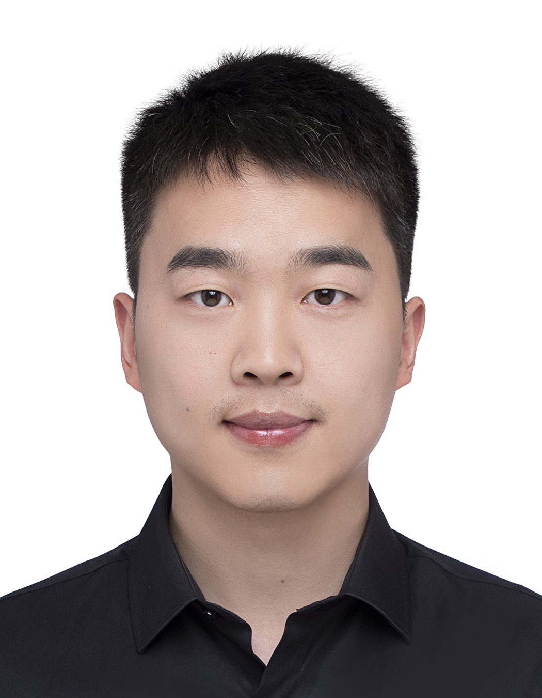

---
output:
  pdf_document: default
  html_document: default
---

# 刘鹏飞 (Pengfei Liu)

**电话 / Phone:** +49 17644544310  
**邮箱 / Email:**  
liupengfei50@live.com  
pengfei.liu@tuebingen.mpg.de

---

## 教育背景 / Education

**博士在读 / Ph.D. in Biology**  
Max Planck Institute for Biology Tübingen, Tübingen, Germany  
2021年一月 - 至今 / January 2021 - Present

**硕士 / M. Sc. in Marine Biology**  
上海海洋大学 / Shanghai Ocean University, Shanghai, China  
2017年九月 - 2020年六月 / September 2017 - June 2020

---

## 研究方向 / Research Interests

- Sex determination, chromosomal evolution, genomics, epigenetics, bioinformatics in brown algae  
- 褐藻的性别决定、染色体进化、基因组学、表观遗传学、生物信息学

---

## 研究经历 / Research Experience

### Max Planck Institute for Biology Tübingen  
**PhD Student, Susana Coelho Lab & Chang Liu Lab**  
Tübingen, Germany | January 2021 - Present

- Led studies on chromatin architecture in brown algae using high-throughput genomics and bioinformatics.
- Applied epigenomics to investigate chromatin roles during viral infection in reproductive cells of *Ectocarpus sp7*.

### Shanghai Ocean University  
**Master Student, Zhigang Zhou Lab**  
Shanghai, China | September 2017 - June 2020

**Thesis:** Construction of a BAC library of female gametophytes of *Saccharina japonica* and map cloning/sequencing of genes neighboring a female-specific marker FRML-1488.

- Built a 3D BAC library for female gametophytes of *S. japonica*.
- Screened, sequenced, and assembled sex-related BAC clones.

---

## 发表文章 / Publications

1. **Pengfei Liu**, Jeromine Vigneau, Rory Craig, et al. 2024. "3D Chromatin Maps of a Brown Alga Reveal U/V Sex Chromosome Spatial Organization". **Nature Communications**, 15, 9590. [doi:10.1038/s41467-024-53453-5](https://doi.org/10.1038/s41467-024-53453-5)

2. Josué Barrera-Redondo†, Agnieszka P Lipinska†, **Pengfei Liu**, et al. 2024. "Origin and Evolutionary Trajectories of Brown Algal Sex Chromosomes". **bioRxiv**: 2024.01.15.575685. [doi:10.1101/2024.01.15.575685](https://doi.org/10.1101/2024.01.15.575685) (accept in principle by **Nature Ecology and Evolution**)

3. **Pengfei Liu**, Yanhui Bi, Qian Zheng, et al. 2023. "Molecular and FISH Analysis of 45S rDNA on BAC Molecule of *Saccharina japonica*". **Aquaculture and Fisheries** 8(2). [doi:10.1016/j.aaf.2021.07.002](https://doi.org/10.1016/j.aaf.2021.07.002)

4. Yu Du, **Peng Fei Liu**, Zhi Li, et al. 2022. "Discerning the Putative U and V Chromosomes of *Saccharina japonica* by Cytogenetic Mapping of Sex-Linked Molecular Markers". **Frontiers in Marine Science** 9. [doi:10.3389/fmars.2022.821603](https://doi.org/10.3389/fmars.2022.821603)

5. **Pengfei Liu**, Jungang Gu, Yanhui Bi, et al. 2021. "Construction of a BAC Library of Female Gametophytes of *Saccharina japonica* and Map Cloning and Sequencing of Genes Neighboring a Female-Specific Marker FRML-1488". **Journal of Fisheries of China** 45(5). [doi:10.11964/jfc.20200112143](https://doi.org/10.11964/jfc.20200112143)

6. Yu Liu, **Pengfei Liu**, Yanhui Bi, et al. 2021. "Chromosomal Mapping of 5S and 18S-5.8S-25S rRNA Genes in *Saccharina japonica* by Dual-Color FISH". **Journal of Oceanology and Limnology** 39(2). [doi:10.1007/s00343-020-9276-5](https://doi.org/10.1007/s00343-020-9276-5)

7. Wu Shan Dong†, **Peng Fei Liu†**, Yu Liu, et al. 2020. "Immunocytochemical Localization of the Kinetochore Protein Nuf2p on Gametophyte Chromosomes of a Saccharina Cultivar". **Frontiers in Marine Science** 7. [doi:10.3389/fmars.2020.539260](https://doi.org/10.3389/fmars.2020.539260)

---

## 学术会议 / Conference Presentations

1. September 2025, **Oral Presentation**, European Society for Evolutionary Biology (ESEB) Congress, Barcelona, Spain
2. July 2025, **Oral Presentation**, BioConnect Symposium, Tübingen, Germany
3. October 2024, **Poster Presentation**, Molecular Mechanisms in Evolution and Ecology, EMBL, Heidelberg, Germany

---

## 语言能力 / Languages

- English (fluent)
- Chinese (native)

---

## 奖项与资助 / Awards & Funding

- 2020 国家公派留学基金 / Chinese Government Scholarship, Shanghai, China

---

## 技能 / Skills

- **分子生物学实验 / Molecular Biology:** DNA/RNA extraction, PCR, qPCR, RNA-seq, ChIP-seq, ATAC-seq, Hi-C, Illumina/Nanopore library prep, FISH, immunofluorescence, expansion microscopy, flow cytometry
- **编程 / Programming:** R (advanced), Python (advanced), HPC (Slurm, SGE), version control (GitHub)
- **多组学整合分析 / Multi-omics Integration:**  
  - Specialized in integrating and analyzing multi-omics datasets, focusing on chromatin interactions, gene regulation, and epigenomics.
  - Proficient in applying bioinformatics tools to address complex biological questions and drive discoveries in regulatory genomics.

---
